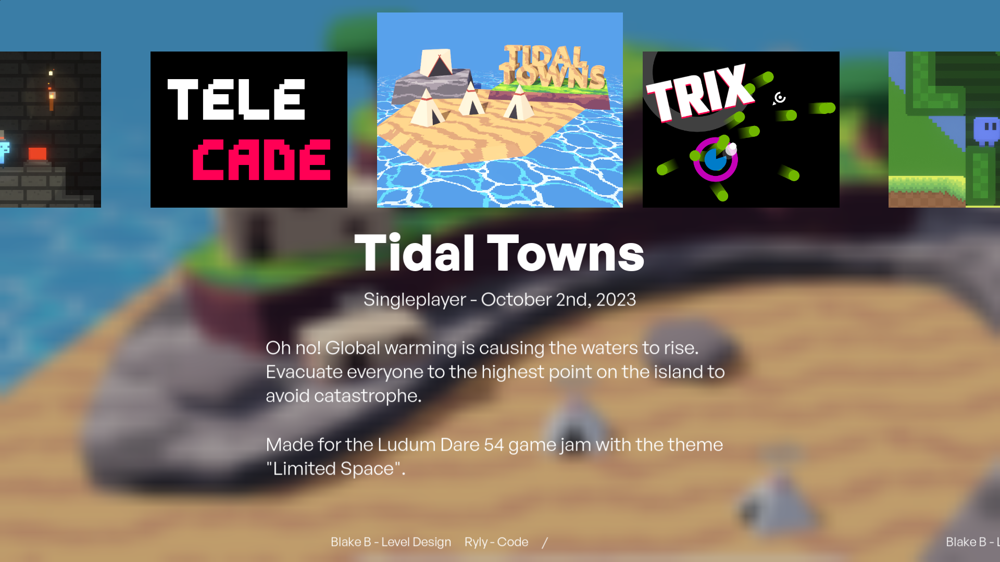
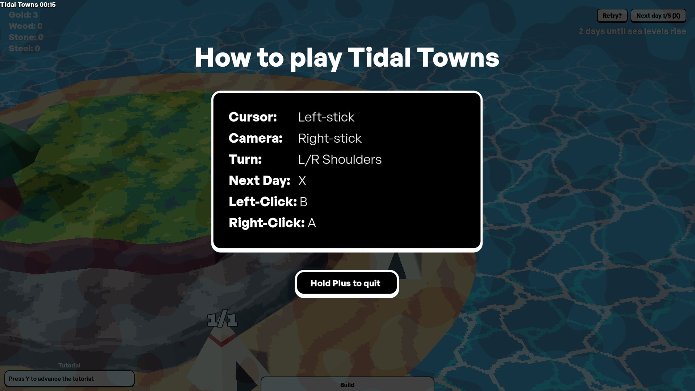

# Democade

> _Demonstration + Arcade_

A launcher+overlay for made in [Godot 4](https://godotengine.org/). Intended for demonstrating games at events. Made for a local STEAM fair showcase.






> [!WARNING]
> Early development. Expect breaking changes.


## Features

- Linux and Windows support. [Why no Mac support?](#why-no-mac-support)
- Gamepad centric user interface.
- [Help manual overlay.](#game-help-manual---helptxt)
- Easy to add new games using a [simple folder structure](#folder-structure).
- Customizable and hackable. _Check out the code!_
- Compatible with games made in any engine. (Tested with Godot 3/4 and Unity)
- Handles came crashes gracefully.
- Background music on launcher.

Checkout the [Roadmap](./ROADMAP.md)!


## Folder structure
```
(root)
├── arcade.x86_64
├── config.json
├── games/
│   └── game_id/
│       ├── title.json
│       ├── cover.[png|jpg|webp]
│       ├── about.txt
│       ├── credits.txt
│       ├── help.txt
│       └── images/
│           └── img.[png|jpg|webp]
└── music/
    └── Song Display Name.[mp3|ogg]
```

- `[png|jpg|webp]` Means you can use PNG, JPEG, and WebP.
- `[mp3|ogg]` Means you can use MP3 and Ogg Vorbis.


## Config - `config.json`

Follows the [JSON syntax](https://en.wikipedia.org/wiki/JSON#Syntax).

The paths where games and music are stored can be configured with `games_path` and `music_path`. `./` can be used at the start to be relative to the folder where the executable is stored.

- `shuffle_games`: By default games are sorted alphabetically by their id. Setting this to true will shuffle the games **on startup**.
- `shuffle_credits`: By default credits appear in the order they were written. Setting this to true will shuffle the credits **on startup**. (Can be overridden per game)
- `music_volume`: Linear music volume (0.0 - 1.0). Music is randomly played on the menu and in game if `play_music` is true in the game configuration.


## Game Configuration

Each game folder follows this structure:

```
game_id/
├── title.json
├── cover.[png|jpg|webp]
├── about.txt
├── credits.txt
├── help.txt
└── images/
    └── img.[png|jpg|webp]
```

### Game Configuration - `title.json`

Follows the [JSON syntax](https://en.wikipedia.org/wiki/JSON#Syntax).

- `title`: **(Required)** The title of the game. Use `\"` to to include quotes within the title.
- `exec`: **(Required)** The file or command that should to ran to start the game.
- `args`: And array of arguments (strings) that a given to the program (eg. `["--fullscreen", "--skip-intro"]`).
- `play_music`: Continues playing the menu music when playing the game. Recommended if the game does not include its own music.
- `show_cursor`: By default the cursor is constantly moved to the bottom-right side of the screen to hide it. Setting this to true will stop the moving of the cursor. (Always enabled in debug mode)
- `shuffle_credits`: Overrides `shuffle_credits` from `config.json`.


### Game Description - `about.txt`

Create a `about.txt` inside the game folder. [Godot BBCodes](https://docs.godotengine.org/en/stable/tutorials/ui/bbcode_in_richtextlabel.html) may be used for special formatting.


### Game Credits - `credits.txt`

Create a `credits.txt` inside the game folder. Each line is one entry in the credits.


### Game Help Manual - `help.txt`

Create a `help.txt` inside the game folder. This is displayed when the game is started or Plus is pressed. Tab width is 24 characters wide so tabs may be used for alignment. [Godot BBCodes](https://docs.godotengine.org/en/stable/tutorials/ui/bbcode_in_richtextlabel.html) may be used for special formatting.


## Use Gamepad as Cursor

This repo includes a script that can be used in a Godot 4 project to allow controlling the mouse cursor using a Gamepad. (PRs welcome to add support for other Engines)

Find the scripts in [/docs/joy_cursor/](./docs/joy_cursor/).


## Notes / FAQ

### Why no Mac support?

MacOS handles fullscreen windows differently which is not compatible with how this program handles overlays. It is likely that games will need to be modified to render the overlays themselves. (Help needed)


## Credits

- Inspired by [MrEliptik/game_launcher](https://github.com/MrEliptik/game_launcher).
- Credits marquee is powered by [Marquee Label Control](https://github.com/markeel/godot-marquee).
- Font: [General Sans by Indian Type Foundry](https://www.fontshare.com/fonts/general-sans).
